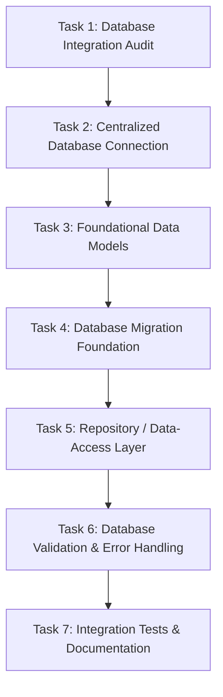

# Database Integration Audit & Architectural Specification

**Author:** Skan (Backend Developer)  
**Date:** Day 2 of 21-Day Roadmap  
**Scope:** Persistence Layer, Data Models, Migrations, and Repositories (`/backend`)

---

## 1. Executive Summary

This audit evaluates the current persistence architecture for the **Smart Student Commute Companion** backend. As of Day 1, persistence is managed through an embedded SQLite database (`commute.db`) operating with direct prepared statements. While functional for baseline prototyping, the persistence layer currently lacks formal data models, a versioned schema migration framework, a decoupled Data Access Layer (DAL), and standardized database error mapping.

The goal of Day 2 is to transform this raw, inline SQL persistence into a robust, layered, and verifiable database foundation through 7 sequential tasks without breaking existing features or altering the frontend API contracts.

---

## 2. Existing Database Architecture

### 2.1 Technology Stack & Drivers
- **Database Engine**: SQLite 3 (`commute.db`), configured with Write-Ahead Logging (`PRAGMA journal_mode = WAL`) and synchronous normal mode for read/write concurrency.
- **Primary Driver**: `better-sqlite3` (`v11.8.1`) - Synchronous, high-performance C++ native SQLite bindings for Node.js.
- **Dual-Engine Compatibility Shim**: In Day 1, a polyfill layer was introduced in `backend/db/database.js` to support Node.js v22+ built-in `node:sqlite` (`DatabaseSync`), providing custom shims for `pragma()` and `transaction()`. This ensures zero native compilation failures on Windows and constrained container environments.
- **Connection Instantiation**: Eagerly instantiated on module import via `instantiateDatabase()` in `backend/db/database.js`.

### 2.2 Existing Tables & Schema Topology

The database currently provisions 10 tables on startup via `initDb()`:

| Table Name | Primary Key | Purpose | Record Size / Cardinality |
| :--- | :--- | :--- | :--- |
| `geocoding_cache` | `query` (TEXT) | Caches reverse-geocoded spatial lookups | Dynamic (~30–500 rows) |
| `live_commute_reports` | `id` (TEXT) | Crowdsourced disruption reports with expiry | Dynamic (~10–1,000 rows) |
| `live_report_confirmations` | `id` (INTEGER AUTO) | Deduplicated user votes on disruption reports | Dynamic, `UNIQUE(report_id, user_token)` |
| `ride_groups` | `id` (TEXT) | "Travel Together" buddy carpool/walking groups | Dynamic (~10–200 rows) |
| `feedback` | `id` (TEXT) | Route rating and qualitative user feedback | Dynamic append-only |
| `gtfs_agency` | `agency_id` (TEXT) | Static transit agencies (WR, CR, BEST, Metro) | Static (4 agencies) |
| `gtfs_routes` | `route_id` (TEXT) | Static route numbers and line colors | Static (~150 routes) |
| `gtfs_stops` | `stop_id` (TEXT) | Transit stop coordinates and location types | Static (~1,800 stops, indexed on `stop_lat, stop_lon`) |
| `gtfs_trips` | `trip_id` (TEXT) | Scheduled train, metro, and bus trips | Static (~2,500 trips, indexed on `route_id`) |
| `gtfs_stop_times` | Compound | Scheduled arrival/departure times per stop | Static (~45,000 stop times, indexed on `stop_id`, `trip_id`) |

### 2.3 Current Query Patterns & Deficiencies
Currently, SQL queries are embedded directly within controllers and domain services:
- **`controllers/rideGroupController.js`**: Direct `db.prepare('SELECT ...')` and `db.prepare('INSERT ...')`.
- **`controllers/reportController.js`**: Direct SQL updates for confirmation and contradiction tallies.
- **`controllers/feedbackController.js`**: Direct raw inserts.
- **`controllers/transitController.js`**: Direct text pattern matching (`LIKE ?`).
- **`services/geocodingService.js`**: Direct read/write to `geocoding_cache`.
- **`services/gtfsService.js`**: Complex spatial bounding-box SQL queries on `gtfs_stops` and schedule joins.
- **`services/disruptionService.js`**: Direct queries on `live_commute_reports`.

---

## 3. Core Entities Required by the Project

The project requires the following domain entities to support student commute intelligence:

### 1. `LiveReport`
- **Identity**: `id` (`rep-<timestamp>-<hash>`)
- **Attributes**: `pseudonym`, `area`, `route_name`, `route_id`, `mode`, `message`, `impact` (`low`\|`medium`\|`high`), `status` (`active`\|`expired`\|`resolved`), `created_at`, `expires_at`, `confirmation_count`, `contradiction_count`.
- **Invariants**: Expiration must be greater than creation timestamp; contradiction count threshold triggers status update.

### 2. `ReportConfirmation` (Vote)
- **Identity**: `id` (Auto-increment integer)
- **Attributes**: `report_id`, `user_token`, `action` (`confirm`\|`contradict`), `created_at`.
- **Invariants**: Strict uniqueness constraint `(report_id, user_token)` prevents vote brigading or ballot stuffing.

### 3. `RideGroup`
- **Identity**: `id` (`grp-<timestamp>-<hash>`)
- **Attributes**: `creator_pseudonym`, `origin_area`, `destination_college`, `departure_time`, `mode`, `max_members`, `current_members`, `notes`, `created_at`.
- **Invariants**: `current_members` cannot exceed `max_members` ($2 \le \text{max\_members} \le 6$).

### 4. `Feedback`
- **Identity**: `id` (`fb-<timestamp>`)
- **Attributes**: `recommendation_id`, `is_useful` (boolean/integer), `tags` (JSON array of strings), `comment`, `created_at`.
- **Invariants**: `recommendation_id` links to historical or generated route recommendations.

### 5. `GeocodingCache`
- **Identity**: `query` (Normalized lowercased place query)
- **Attributes**: `lat`, `lon`, `display_name`, `created_at`.
- **Invariants**: Valid Mumbai spatial bounding coordinates ($18.8^\circ\text{N} \le \text{lat} \le 19.4^\circ\text{N}$, $72.7^\circ\text{E} \le \text{lon} \le 73.1^\circ\text{E}$).

### 6. `TransitStop` & `TransitRoute`
- **Identity**: `stop_id`, `route_id`.
- **Attributes**: Official Mumbai GTFS transit timetable, platform metadata, and spatial coordinates.

---

## 4. Completed vs. Missing Database Functionality

| Dimension | Completed Functionality (Day 1) | Missing Functionality (Day 2 Focus) |
| :--- | :--- | :--- |
| **Connection Management** | Eager module instantiation; dual `better-sqlite3` and `node:sqlite` fallback. | Centralized connection lifecycle (`connect`, `close`, `ping`, `getStatus`), explicit connection verification, and graceful shutdown integration. |
| **Data Models** | None (Raw DB result rows passed directly to Express handlers). | Formal domain model classes with field schema enforcement, type coercion, and business validation. |
| **Migrations** | Startup inline `CREATE TABLE IF NOT EXISTS` in `database.js`. | Versioned migration runner, `schema_migrations` audit table, repeatable `up`/`down` migrations, rollback capability. |
| **Data Access Layer** | Scattered `db.prepare()` queries mixed with routing and controllers. | Dedicated repository classes (`ReportRepository`, `RideGroupRepository`, `FeedbackRepository`, `GeocodingRepository`). |
| **Validation & Error Handling** | Zod validation at controller boundary only; unhandled SQLite errors return generic 500. | Database constraint error mapper (`SQLITE_CONSTRAINT` $\rightarrow$ `ConflictError`, missing record $\rightarrow$ `NotFoundError`), boundary data sanitizer. |
| **Testing & CI** | End-to-end integration test against live server only. | Isolated database integration tests using in-memory or ephemeral SQLite databases without mutating live data. |

---

## 5. Day 2 Implementation Plan (Tasks 2 to 7)

1. **Task 2/7 — Centralized Database Connection**:
   - Create `backend/db/connection.js` providing a managed connection singleton.
   - Support connection lifecycle methods: `getConnection()`, `closeConnection()`, `ping()`, `getConnectionStatus()`.
   - Read configuration from `backend/config/index.js` with path validation and safe error handling.
   - Maintain full backward compatibility with existing `database.js` exports.
2. **Task 3/7 — Foundational Data Models**:
   - Create foundational models under `backend/models/`:
     - `LiveReport.js`, `ReportConfirmation.js`, `RideGroup.js`, `Feedback.js`, `GeocodingCache.js`.
   - Implement field sanitization, default generators, and domain invariants.
3. **Task 4/7 — Database Migration Foundation**:
   - Establish migration system under `backend/migrations/`.
   - Create `migrationRunner.js` managing the `schema_migrations` table.
   - Author `001_initial_schema.js` matching active schema with full `up()` and `down()` support.
   - Expose `npm run db:migrate` and `npm run db:rollback`.
4. **Task 5/7 — Repository / Data-Access Layer**:
   - Create repositories under `backend/repositories/`:
     - `ReportRepository.js`: fetchActive, create, addConfirmation, addContradiction.
     - `RideGroupRepository.js`: listRecent, findById, create, incrementMembers.
     - `FeedbackRepository.js`: create, listByRecommendation.
     - `GeocodingRepository.js`: getCached, setCached.
   - Refactor controllers to utilize repositories, removing raw SQL from route files.
5. **Task 6/7 — Database Validation and Error Handling**:
   - Create `backend/db/dbErrors.js` mapping SQLite errors (`SQLITE_CONSTRAINT_UNIQUE`, `SQLITE_BUSY`, `SQLITE_CORRUPT`) into application-level errors (`ConflictError`, `BadRequestError`, `AppError`).
   - Wrap repository executions in standard error translation to prevent SQL statement leakage.
6. **Task 7/7 — Database Integration Tests and Documentation**:
   - Author automated integration test suite `backend/scripts/verify_database.js`.
   - Test connection lifecycle, model persistence, unique constraints, and migration rollbacks in an isolated temporary database.
   - Update `backend/docs/architecture.md` and add `npm run test:db` command.
