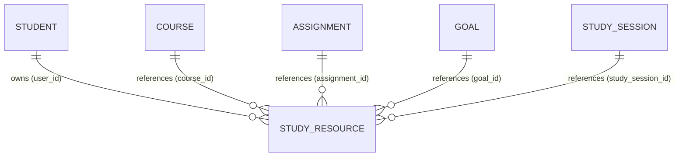

# Student Study Resources System Documentation

## Overview

The **Student Study Resources Subsystem** delivers a unified, deterministic backend architecture for student-owned study materials, notes, documents, visualizers, and references. It integrates with academic workflows (Courses, Assignments, Goals, and Study Sessions), the unified search engine, and a deterministic contextual retrieval engine.

---

## 1. Domain Capabilities

Students can store and manage heterogeneous study materials categorized into standard resource types:
- `note`: Text notes, summaries, lecture key takeaways, cheatsheets.
- `link`: External reference links, web visualizers, documentation URLs, GitHub repositories.
- `reference`: Formal paper references, textbook citations, reading assignments.
- `document`: Uploaded files and study documents (PDFs, PPTXs, diagrams) with file metadata (`file_name`, `file_size`, `mime_type`).
- `other`: Generic study artifacts.

### Key Operations
- **Full Lifecycle CRUD**: Create, read, update, hard delete.
- **Favorites & Archival**: Dedicated endpoints to toggle favorite flag (`is_favorite`) and soft-archive/restore (`archived`).
- **Flexible Tagging**: JSON-serialized tag arrays supporting normalized filtering and search matching.
- **Scoping & Isolation**: Strict student-level data barriers; non-owning students cannot view, modify, link, or search foreign materials (403 Forbidden).

---

## 2. Multi-Domain Entity Relationships

Study resources connect relationally with the existing student academic entities:

### Referential Integrity & Cascading Rules
- `user_id REFERENCES users(id) ON DELETE CASCADE`: Deleting a student cascades and deletes all their study resources.
- `course_id REFERENCES courses(id) ON DELETE SET NULL`: Deleting a course unlinks the resource by setting `course_id = NULL` without deleting the student's study materials.
- `assignment_id REFERENCES assignments(id) ON DELETE SET NULL`: Deleting an assignment preserves the resource.
- `goal_id REFERENCES goals(id) ON DELETE SET NULL`: Deleting a goal preserves the resource.
- `study_session_id REFERENCES study_sessions(id) ON DELETE SET NULL`: Deleting a calendar study session preserves the resource.

---

## 3. Dedicated Workflow Endpoints

In addition to core CRUD, dedicated workflow endpoints enable atomic linking and unlinking from academic and planning entities:

### Courses
- `GET /api/academic/courses/:id/resources`: List resources attached to the course.
- `POST /api/academic/courses/:id/resources`: Batch link resources (`{ resource_ids: [...] }`).
- `DELETE /api/academic/courses/:id/resources/:resourceId`: Unlink a resource from the course.

### Assignments
- `GET /api/academic/assignments/:id/resources`: List resources attached to the assignment.
- `POST /api/academic/assignments/:id/resources`: Batch link resources (`{ resource_ids: [...] }`).
- `DELETE /api/academic/assignments/:id/resources/:resourceId`: Unlink a resource from the assignment.

### Student Goals
- `GET /api/academic/goals/:id/resources`: List resources attached to the goal.
- `POST /api/academic/goals/:id/resources`: Batch link resources (`{ resource_ids: [...] }`).
- `DELETE /api/academic/goals/:id/resources/:resourceId`: Unlink a resource from the goal.
- `GET /api/academic/goals/:id/work`: Unified dashboard summary aggregating tasks, study sessions, and supporting study resources.

### Study Sessions
- `GET /api/calendar/study-sessions/:id/resources`: List resources attached to the scheduled study session.
- `POST /api/calendar/study-sessions/:id/resources`: Batch link resources (`{ resource_ids: [...] }`).
- `DELETE /api/calendar/study-sessions/:id/resources/:resourceId`: Unlink a resource from the study session.

---

## 4. Contextual Resource Retrieval Engine

Exposed via canonical `GET /api/student/resources/context` and parity alias `GET /api/academic/resources/context`.

The context engine is **100% deterministic** and grounded in verified SQLite database relationships. It does not use LLMs, vector embeddings, or heuristic guesses.

| Context Type | Query Parameter | Resolution Strategy |
|---|---|---|
| **Course** | `?courseId=...` | Direct course resources + resources linked to child assignments, goals, and study sessions in the course. |
| **Assignment** | `?assignmentId=...` | Directly attached assignment resources + parent course reference materials + parent goal supporting resources. |
| **Goal** | `?goalId=...` | Direct goal resources + associated course materials + resources linked to goal tasks and study sessions. |
| **Study Session** | `?studySessionId=...` | Direct session resources + matching course resources + linked goal and task resources. |
| **Recent / Active** | (default / `?recent=true`) | Student favorites (`is_favorite = 1`), recently updated items, and resources linked to active/pending workload. |

### Deterministic Ranking & Deduplication
- Items deduplicated across relational branches.
- Direct attachments rank first (`isDirect: true`).
- Favorites rank next (`is_favorite: 1`).
- Recency ranks third (`updated_at DESC`).
- Every returned item contains a `contextRelation` metadata object (`relation`, `reason`, `isDirect`).

---

## 5. Unified Student Search Integration

Study resources are registered as first-class domain citizens in the centralized search engine (`GET /api/student/search` and `GET /api/academic/search`).

- **Indexed Search Fields**: `title`, `description`, `content`, `resource_type`, `tags`, `file_name`, `url`, and associated course `name` and `code`.
- **Zero N+1 Course Metadata Enrichment**: Search automatically resolves associated course details (`name`, `code`, `color`) via pre-cached joins.
- **Type Filter Aliases**: `types=resources`, `types=study_resource`, `types=notes`, `types=materials`.
- **Multi-Attribute Ranking**: Prioritizes exact title matches (+150), prefix title matches (+85), tag matches, and active deliverable associations.

---

## 6. Authorization Rules

1. **Mandatory Bearer Authentication**: Every resource route requires a valid student JWT (`requireAuth`).
2. **Student Scoping**: Queries automatically scope rows with `user_id = req.user.id`.
3. **Cross-Student Barrier**:
   - Accessing another student's resource yields `403 Forbidden`.
   - Linking another student's course, assignment, goal, or session yields `403 Forbidden`.
   - Requesting context for another student's academic entity yields `403 Forbidden`.
   - Searching returns zero records from other students (strict SQL isolation).
4. **Invalid Reference Handling**: Referencing a non-existent entity yields `404 Not Found`.

---

## 7. Performance & Database Optimization

- **Targeted SQLite Indexes**:
  - `idx_study_resources_user_id`: Primary user-scoped lookup index.
  - `idx_study_resources_user_type`: Composite user and type filtering index.
  - `idx_study_resources_user_archived`: User archive status filtering index.
  - `idx_study_resources_user_favorite`: User favorite filtering index.
  - `idx_study_resources_course_id`: Foreign key join index.
  - `idx_study_resources_assignment_id`: Foreign key join index.
  - `idx_study_resources_goal_id`: Foreign key join index.
  - `idx_study_resources_study_session_id`: Foreign key join index.
  - `idx_study_resources_user_created`: User recency ordering index.
- **Zero N+1 Queries**: Relational context queries and search enrichment utilize SQL `JOIN` statements and in-memory Map lookups.
- **Sensible Bounds**: Pagination enforced at `limit <= 50`, `offset <= 1000`.

---

## 8. Known Limitations

- **Binary File Storage**: Documents store metadata (`file_name`, `file_size`, `mime_type`, `url`); binary payload persistence is intended for external object storage or separate multipart attachment handlers.
- **Text Substring Search**: Full-text searching uses SQLite `LIKE` tokenization with ranking; SQLite FTS5 extension can be enabled in future releases if multi-megabyte note contents are stored.
