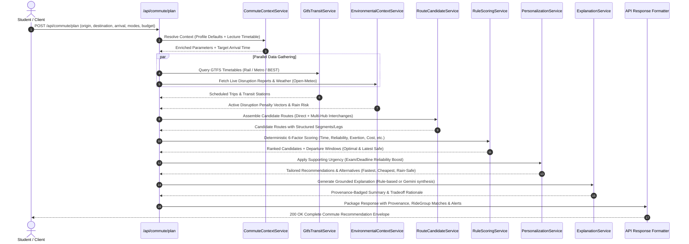

# Smart Commute Domain Backend Architecture

> **Document Version**: 1.0.0  
> **Date**: 2026-10-05  
> **Author**: Skan (Backend Lead)  
> **Status**: Approved Architectural Blueprint  
> **Scope**: Backend Domain Design for P9 — Smart Student Commute Companion

---

## 1. Architectural Mission & Core Principles

The **Smart Commute Domain** is the core functional engine of the **Smart Student Commute Companion (P9)**. Its objective is to provide deterministic, privacy-first, multimodal commute planning tailored specifically to college students navigating Mumbai's complex transit network.

```text
Student Input
    ↓
Commute Context
    ↓
Transport / Route Data
    ↓
Disruption Analysis
    ↓
Candidate Routes
    ↓
Rule-Based Recommendation
    ↓
Personalization
    ↓
Explanation
    ↓
Alerts / Feedback / Sharing
```

### Architectural Guiding Principles

1. **Lightweight & Self-Contained (No Heavy Maps Stack)**:
   - Do **NOT** install or deploy heavy GIS infrastructure (e.g. PostGIS, GeoServer, TileServer GL) or proprietary commercial map SDKs.
   - Transit routing runs directly over optimized SQLite queries against local Mumbai GTFS tables.
   - Walking and road routing use lightweight public OSRM endpoints (`router.project-osrm.org`) with a deterministic, zero-dependency Haversine distance fallback.
2. **Determinism-First, Zero-Hallucination AI**:
   - All candidate route generation, transfer calculations, timetable lookups, and multi-criteria scoring are **100% deterministic algorithms**.
   - Artificial Intelligence (Gemini) is **never used to hallucinate routes, transit stops, or fares**. It serves strictly as a natural language synthesis layer that reads deterministic route facts and formats conversational explanations. When API keys are absent or network requests fail, a deterministic rule-based template builder takes over with zero disruption.
3. **Strict Privacy by Design (Area-Level Landmark Inputs)**:
   - The system accepts **only coarse area names or landmarks** (e.g. "Borivali West", "Andheri Station", "VJTI College").
   - **Zero exact street addresses, flat numbers, or house numbers** are accepted or stored.
   - **Zero continuous GPS tracking or coordinate history** is retained. Request coordinates are ephemeral and discarded immediately after route calculation.
4. **Infrastructure Reuse (Zero Duplication)**:
   - Reuses existing backend foundation: SQLite database with dual-driver support (`better-sqlite3` + `node:sqlite`), Zod validation middleware, operational error hierarchy (`AppError`), unified API response conventions, in-app notifications (`NotificationService`), and timed reminders (`ReminderScheduler`).
5. **Explicit 4-Tier Data Provenance**:
   - Every route attribute, delay alert, and estimate must carry an explicit, immutable provenance badge (`VERIFIED`, `USER_REPORTED`, `ESTIMATED`, or `SYNTHETIC`).

---

## 2. End-to-End Pipeline & Data Flow Architecture

The commute planning workflow operates as an 9-stage sequential pipeline:



---

## 3. Domain Responsibilities & Service Boundaries

The Smart Commute domain is structured into clear, decoupled sub-services within `backend/services/commute/`:

```
backend/services/commute/
├── commuteContextService.js       # Student profile defaults & lecture timetable integration
├── geocodingAreaService.js        # Landmark-to-coordinate mapping (area-level only)
├── gtfsTransitService.js          # SQLite GTFS timetable queries for Mumbai WR/CR/Metro/BEST
├── interchangeHubService.js       # Multi-leg transfer graph (Andheri, Dadar, Kurla, etc.)
├── routeCandidateService.js       # Assembles multimodal route options and route legs
├── routeGeometryService.js        # OSRM road/walk geometry with Haversine fallback
├── environmentalContextService.js # Weather, crowdsourced disruptions, and traffic heuristics
├── trafficHeuristicService.js     # Time-of-day peak congestion curves for Mumbai corridors
├── waterloggingHotspotService.js  # Monsoon flood vulnerability mapping
├── ruleScoringService.js          # Deterministic 6-factor scoring engine
├── departureWindowCalculator.js   # Optimal and latest safe departure times
├── personalizationService.js      # Deadline urgency weighting and preference matching
├── explanationService.js          # Dual-layer explanation engine (Gemini + Rule-based fallback)
├── provenanceTagger.js            # 4-tier data provenance assignment
└── commuteFeedbackService.js      # Feedback aggregation and route reliability calibration
```

### Detailed Responsibility Matrix

| Responsibility Area | Assigned Service / Component | Input Data | Output / Function |
| :--- | :--- | :--- | :--- |
| **Commute Preferences** | `commuteContextService.js` | Request body or `StudentProfile` (`user_id`) | Default modes, walking tolerance, max budget, arrival time. |
| **Origin & Destination Areas** | `geocodingAreaService.js` | Coarse area/landmark string (e.g. "Dadar West") | Approximate landmark coordinates (`lat`, `lon`). **Zero house addresses**. |
| **Transport Modes** | `routeCandidateService.js` | Array of allowed modes (`train`, `metro`, `bus`, `auto`, `walk`, `shared_auto`) | Filters eligible transit trips and multimodal combinations. |
| **Routes & Representation** | `routeCandidateService.js`<br>`models/CommuteRoute.js` | Stations, timetable records, road geometries | Structured route object: `id`, `title`, `durationMinutes`, `fareRupees`, `legs`, `provenance`. |
| **Route Segments (Legs)** | `models/RouteLeg.js` | Stop sequences, transfer points, road segments | Formal leg structure: `mode`, `from`, `to`, `departureTime`, `arrivalTime`, `durationMinutes`, `distanceKm`, `provenance`. |
| **Timetable Data** | `gtfsTransitService.js` | Origin/Destination station pair, target time | Scheduled departure/arrival times from `gtfs_stop_times` and `gtfs_trips`. |
| **Travel Estimates** | `routeGeometryService.js`<br>`gtfsTransitService.js` | GTFS stop times + OSRM walking/driving | Transit duration + road travel minutes with confidence intervals. |
| **Traffic Congestion** | `trafficHeuristicService.js` | Time of day, road corridor (WEH, EEH, SV Road) | Deterministic peak-hour congestion multipliers (1.0x to 1.8x). |
| **Live Disruptions** | `environmentalContextService.js` | Active `LiveReport` records from SQLite | Corridors affected, decay-weighted disruption scores. |
| **Weather Intelligence** | `environmentalContextService.js`<br>`weatherService.js` | Open-Meteo live API / cache | Rain probability, condition, walking penalty factor. |
| **Waterlogging Hotspots** | `waterloggingHotspotService.js` | Route geometry, rain intensity | Detects chronic flood subways (Milan, Andheri Subway, Hindmata). |
| **Transport Availability** | `ruleScoringService.js` | Mode type, rain status, time of day | Dynamic reliability ratings (e.g. auto availability drops in heavy rain). |
| **Route Scoring** | `ruleScoringService.js` | Candidate routes, environmental penalty vector | Normalized multi-criteria score (0–100) per candidate. |
| **Recommendations & Alts** | `ruleScoringService.js` | Scored candidates | Top choice + Fastest Alternative, Lowest-Cost, Rain-Safe. |
| **Departure Windows** | `departureWindowCalculator.js` | Desired arrival time, total duration, buffer | `optimalDepartureTime`, `latestSafeDepartureTime`, `recommendedWindow`. |
| **Explanations** | `explanationService.js`<br>`aiPlannerService.js` | Factual candidate routes, weather, disruptions | Natural language rationale highlighting trade-offs without hallucination. |
| **Proactive Alerts** | `AlertService`<br>`notificationService.js` | Active disruptions matching student's saved route | In-app notification or Socket.IO broadcast before departure. |
| **User Feedback** | `commuteFeedbackService.js`<br>`FeedbackRepository.js` | Post-commute rating, accuracy score, crowd level | Calibrates historical route reliability indices. |
| **Shared Travel** | `rideGroupService.js` | Corridor origin/destination, departure window | Matching active ride groups to share auto/cab fares. |
| **Data Provenance** | `provenanceTagger.js` | Route attributes and data sources | Tags attributes with `VERIFIED`, `USER_REPORTED`, `ESTIMATED`, `SYNTHETIC`. |

---

## 4. Supporting Academic & Calendar Integration

The student's academic and calendar schedule acts as an **intelligent context generator** for the commute system without coupling domain tables:

```mermaid
graph LR
    subgraph AcademicDomain [Academic & Calendar Context]
        Lecture[CalendarEvent: Next Lecture\n09:00 AM @ DJ Sanghvi]
        Exam[Assignment / Exam Deadline\nHigh Priority / High Urgency]
        Schedule[StudentSchedule: Monday Routine\nBorivali -> Vile Parle]
    end

    subgraph CommuteDomain [Smart Commute Engine]
        ArrivalGen[Automated Arrival Time\nTarget: 08:45 AM (15m buffer)]
        UrgencyBoost[Reliability Weight Boost\nPrioritize Dedicated Right-of-Way]
        DefaultRoute[Corridor Quick-Fill\nPre-populated Origin/Dest]
    end

    Lecture -->|Lecture start time| ArrivalGen
    Exam -->|Submission deadline| UrgencyBoost
    Schedule -->|Saved routine| DefaultRoute
```

### Integration Points
1. **Automated Arrival Time Resolution**:
   - When a student requests a commute plan with `useSchedule: true` or omits `desiredArrivalTime`, `CommuteContextService` queries `CalendarEventRepository.findUpcoming(userId)` to find today's first lecture.
   - The required arrival time is automatically set to **15 minutes before the lecture start time**.
2. **Automated Return Commute Window**:
   - The end time of the student's last scheduled lecture or campus study session defines the evening home departure window.
3. **Deadline Urgency Elevation**:
   - When the student has an urgent assignment or exam scheduled today, the route scoring engine automatically elevates the **Reliability weight from 25% to 45%**, steering the student away from road congestion (autos/buses) toward dedicated right-of-way rail/metro.

---

## 5. Four-Tier Data Provenance Model

To satisfy the core requirement that the system *must distinguish verified, user-reported, estimated, and synthetic information*, every piece of route intelligence is tagged with a typed provenance descriptor:

```json
{
  "provenance": {
    "sourceTier": "VERIFIED" | "USER_REPORTED" | "ESTIMATED" | "SYNTHETIC",
    "provider": "Western Railway GTFS" | "Community Commuter Feed" | "OSRM Engine" | "Deterministic Rule Generator",
    "confidence": "HIGH" | "MEDIUM" | "LOW",
    "lastUpdated": 1791244800000,
    "description": "Factual scheduled timetable from official Mumbai GTFS feed."
  }
}
```

### Provenance Classification Scheme

```
+-------------------+-------------------------------------------------------------------------+
| Provenance Tier   | Data Elements Covered                                                   |
+-------------------+-------------------------------------------------------------------------+
| 1. VERIFIED       | - Train, Metro, and BEST bus scheduled departure and arrival times      |
|                   | - Transit station coordinates and platform interchange locations        |
|                   | - Official base ticket fares (UTS rail fares, Metro token fares)        |
+-------------------+-------------------------------------------------------------------------+
| 2. USER_REPORTED  | - Live crowdsourced disruption reports (auto refusals, waterlogging)    |
|                   | - Community verification/contradiction votes and reported crowd levels  |
|                   | - Post-commute feedback accuracy ratings                                |
+-------------------+-------------------------------------------------------------------------+
| 3. ESTIMATED      | - Road travel durations and walking times from OSRM / Haversine         |
|                   | - Open-Meteo precipitation forecasts and rain probability percentages   |
|                   | - Time-of-day peak hour road traffic congestion multipliers             |
|                   | - Auto-rickshaw meter fares (calculated by distance, not flat tickets)  |
+-------------------+-------------------------------------------------------------------------+
| 4. SYNTHETIC      | - Composite multi-criteria route scores (0-100)                         |
|                   | - Departure window recommendations (optimal and latest safe departure)  |
|                   | - Grounded natural language explanations generated by Gemini or rules   |
+-------------------+-------------------------------------------------------------------------+
```

---

## 6. Prototype Boundaries: Real vs Synthetic / Mock

To balance high fidelity for Mumbai students with rapid prototype delivery, domain components are divided into production-grounded elements and deterministic prototype heuristics:

```
+-------------------------------------------------+-------------------------------------------------+
| GROUNDED / REAL IMPLEMENTATION                  | DETERMINISTIC HEURISTIC / MOCK IN PROTOTYPE     |
+-------------------------------------------------+-------------------------------------------------+
| Mumbai Transit Timetables                       | Real-Time Vehicle Positions (GTFS-RT)           |
| -> Full static GTFS tables for Western Railway, | -> Mumbai transit agencies do not publish open  |
|    Central Railway, Metro Lines, BEST buses.    |    GTFS-RT feeds; delays are derived from live  |
|                                                 |    community reports rather than GPS trackers.  |
|                                                 |                                                 |
| Live Weather Intelligence                       | Live Road Traffic Sensor APIs                   |
| -> Real-time weather fetched live from          | -> Avoids paid Google Maps/TomTom API keys;     |
|    Open-Meteo for Mumbai coordinates.           |    uses deterministic peak-hour time-of-day     |
|                                                 |    traffic curves for WEH, EEH, and SV Road.    |
|                                                 |                                                 |
| Road & Walking Distances                        | Waterlogging Telemetry Sensors                  |
| -> OSRM road routing engine with deterministic  | -> Modeled using known historical Mumbai flood  |
|    Haversine fallback.                          |    hotspots mapped to active rain probabilities.|
|                                                 |                                                 |
| Crowdsourced Community Intelligence             | Automated Fleet Dispatch                        |
| -> LiveReport SQLite storage with decay         | -> Shared travel matches students for carpools/ |
|    mechanics and real-time Socket.IO events.    |    autos at landmark meeting points without     |
|                                                 |    integrating commercial taxi dispatch APIs.   |
|                                                 |                                                 |
| Grounded Explainability                         |                                                 |
| -> Strict JSON prompts to Gemini with           |                                                 |
|    zero-hallucination fallback template engine. |                                                 |
+-------------------------------------------------+-------------------------------------------------+
```

---

## 7. Target API Surface & Endpoints

All new commute endpoints will be mounted cleanly under `/api/commute`:

### A. Commute Planning & Routing
- `POST /api/commute/plan` — Primary multimodal commute planning endpoint. Accepts origin landmark, destination college, arrival time, preferred modes, and constraints. Returns recommended route, departure windows, alternatives, weather, active disruptions, and provenance metadata. Works for both anonymous students and authenticated users.
- `GET /api/commute/routes/saved` — List authenticated student's bookmarked commute routes.
- `POST /api/commute/routes/saved` — Save a frequent route shortcut.
- `DELETE /api/commute/routes/saved/:id` — Delete a bookmarked route.

### B. Commute Preferences & Context
- `GET /api/commute/preferences` — Retrieve student's default commute preferences (modes, budget, walking tolerance, home area).
- `PUT /api/commute/preferences` — Update commute preferences.
- `GET /api/commute/context/today` — Retrieve today's commute context: next scheduled lecture arrival time, weather forecast, and active corridor alerts.

### C. Disruption Intelligence & Alerts
- `GET /api/commute/disruptions` — Query active crowdsourced disruption reports with filtering by transit mode or area.
- `POST /api/commute/disruptions` — Submit a community disruption report (broadcasts via Socket.IO).
- `POST /api/commute/disruptions/:id/confirm` — Verify an active report.
- `POST /api/commute/disruptions/:id/contradict` — Contradict a report.
- `GET /api/commute/alerts` — High-priority active transit alerts along student's corridor.

### D. Shared Travel (Travel Together)
- `GET /api/commute/shared-travel` — List active student ride-sharing / shared-auto groups along commute corridors.
- `POST /api/commute/shared-travel` — Create a shared commute group at a designated landmark meeting point.
- `POST /api/commute/shared-travel/:id/join` — Join an open ride group (max 4 members).

### E. Commute Feedback
- `POST /api/commute/feedback` — Submit post-commute feedback (punctuality rating, crowd rating, comment). Updates route reliability metrics.

---

## 8. Data Privacy & Safety Boundaries

The architecture guarantees strict adherence to the privacy constraints of P9:

```
+---------------------------------------------------------------------------------------------+
| PRIVACY BARRIERS & SAFEGUARDS                                                               |
+---------------------------------------------------------------------------------------------+
| 1. Area-Only Geocoding: Origins and destinations are resolved only to landmark centroids    |
|    (e.g., "Andheri Railway Station", "Borivali West"). Street addresses, housing societies, |
|    or building names are strictly rejected by input validators.                             |
|                                                                                             |
| 2. Ephemeral Geolocation: Client coordinates submitted during route calculation exist only  |
|    in memory for the duration of the HTTP request and are NEVER saved to the database.       |
|                                                                                             |
| 3. Zero Continuous Background GPS: The backend exposes zero endpoints for continuous GPS    |
|    tracking, breadcrumb logging, or speed telemetry.                                        |
|                                                                                             |
| 4. Landmark Meeting Points for Shared Travel: Students in Travel Together groups coordinate |
|    only at public transit landmarks (e.g. "Platform 1 East exit", "College Gate 2").        |
|    Zero home pickups are supported.                                                         |
|                                                                                             |
| 5. Anonymized Feedback & Telemetry: Feedback ratings and search metrics strip user IDs       |
|    and auth tokens before aggregating operational reliability statistics.                   |
+---------------------------------------------------------------------------------------------+
```

---

## 9. Architectural Sign-Off

This document formalizes the backend domain design for the Smart Commute system. It establishes explicit service boundaries, data flows, provenance contracts, and privacy safeguards while fully reusing existing infrastructure and contextual academic models.
