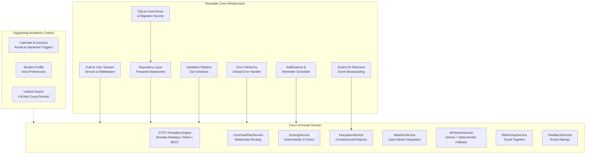
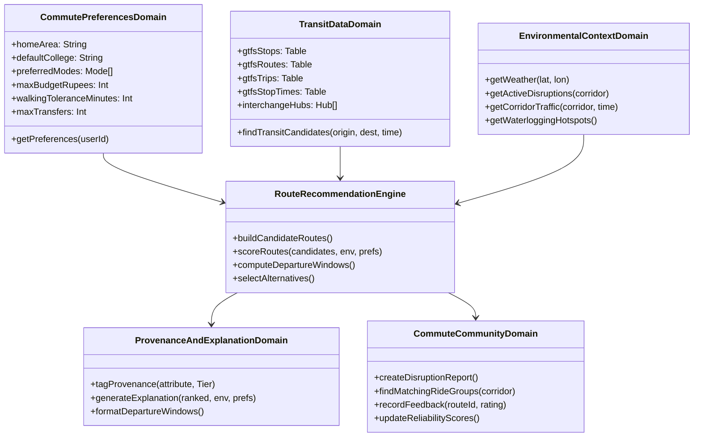

# P9 — Smart Student Commute Companion: Backend Architecture Audit

> **Document Version**: 1.0.0  
> **Date**: 2026-10-05  
> **Author**: Skan (Backend Lead)  
> **Status**: Architectural Reset & Problem Statement Alignment Audit  
> **Problem Statement**: P9 — Smart Student Commute Companion

---

## 1. Executive Summary & Purpose

The confirmed problem statement for this project is:
> **P9 — Smart Student Commute Companion**  
> *An AI/rule-based commute assistant that accepts starting area, college destination, preferred transport modes, arrival time, and basic constraints, then analyzes disruptions and recommends alternative routes, departure windows, mode combinations, shared travel options, alerts, explanations, and feedback.  
> The system must distinguish verified, user-reported, estimated, and synthetic information and must avoid storing precise location history, home addresses, identity details, or continuous tracking data.*

During the earlier sprints of this project (Days 1–3), foundational commute routing, Mumbai GTFS timetable ingestion, crowdsourced live disruption reporting, OSRM routing, Open-Meteo weather intelligence, and ride groups were established. In subsequent sprints (Days 4–13), extensive student academic, scheduling, calendar, goal, and study-planning capabilities were built.

With the PS now officially confirmed as **P9**, this audit establishes an architectural reset. It maps the current backend codebase against the original P9 requirements, categorizes existing infrastructure for reuse, identifies gaps in commute capabilities, delineates how academic features can serve as supporting context, defines strict privacy boundaries, and outlines the component dependency graph for future implementation without deleting existing work.

---

## 2. Core Problem Statement Requirements

| Requirement Area | P9 Specification | Architectural Implication |
| :--- | :--- | :--- |
| **Input Parameters** | Starting area, college destination, preferred transport modes, arrival time, basic constraints (budget, walking limits). | Coarse area-level geocoding only. **Zero** exact street addresses or house numbers. |
| **Routing & Analysis** | Multimodal mode combinations, schedule-aware routing, transit timetable lookups, disruption analysis. | Combines Mumbai local trains (WR/CR/Harbour), Metro, BEST buses, auto-rickshaws, and walking. |
| **Recommendations** | Recommended route, alternative routes (fastest, lowest-cost, rain-safe), departure windows. | Multi-criteria deterministic scoring + departure window calculation. |
| **Shared Travel** | Shared travel options / carpooling / shared autos for students. | Privacy-preserving group coordination based on landmark meeting points. |
| **Alerts & Updates** | Community disruption alerts, weather warnings, proactive delay notifications. | Real-time WebSocket broadcasting and in-app notification dispatching. |
| **Explanations** | Grounded natural language explanations for route choices. | Deterministic rule-based reasoning + Gemini LLM synthesis strictly grounded in factual route data. |
| **Feedback Loop** | Commute feedback, route ratings, crowdedness, accuracy scores. | Structured student feedback collection feeding back into reliability metrics. |
| **Data Provenance** | Strict distinction between verified, user-reported, estimated, and synthetic information. | Every route attribute and alert must carry an explicit, immutable provenance tag. |
| **Privacy Safeguards** | **NO** precise location history, home addresses, personal identity details, or continuous GPS tracking. | Landmark-based origin/destination inputs; in-memory/ephemeral routing requests; zero background tracking. |

---

## 3. Current Backend Architecture Overview

The backend is built as a modular Node.js application in CommonJS, running on Express 4.21 with SQLite persistence.

```
backend/
├── app.js                 # Express application initialization and middleware chain
├── server.js              # HTTP server + Socket.IO WebSocket server entry point
├── config/                # Environment variables, port, database, and API keys
├── db/                    # SQLite connection factory (dual-driver: better-sqlite3 + node:sqlite)
├── migrations/            # Versioned migration runner (migrations 001 through 010 applied)
├── models/                # 22 Domain models with Zod validation and row/JSON transformations
├── repositories/          # 20 Data-access repositories with prepared statements
├── services/              # 37 Domain service modules handling business logic
├── controllers/           # 20 HTTP controllers mapping requests to responses
├── routes/                # 16 Route modules aggregating 162 registered endpoints
├── validators/            # Centralized Zod request validation schemas
├── errors/                # Structured operational error classes extending AppError
├── middleware/            # Auth, error handling, validation, rate limiting safeguards
├── utils/                 # Token signing, API response helpers, Mumbai time formatters
└── scripts/               # Test suites, verification scripts, and GTFS ingestion utilities
```

### Key Technical Characteristics
1. **Persistence**: SQLite (file-based or in-memory) managed via versioned migrations (`migrations/scripts/`).
2. **Dual Database Driver**: Automatic high-performance `better-sqlite3` driver with transparent fallback to Node.js 22+ built-in `node:sqlite`, complete with custom PRAGMA polyfills and re-entrant transaction management.
3. **Transport**: RESTful JSON over HTTP for synchronous requests; Socket.IO over WebSockets for live disruption broadcasts.
4. **Validation**: Strict runtime validation of HTTP bodies, query parameters, and path parameters via Zod.
5. **Security & Identity**: HMAC-SHA256 JWT-style session tokens; `scrypt` password hashing; student ownership authorization guards.

---

## 4. Reusable Infrastructure Mapping

The current backend contains substantial production-grade infrastructure directly reusable for the commute assistant:



### Detailed Infrastructure Audit

| Component | Repository Location | Current Capabilities | Reusability in Commute PS |
| :--- | :--- | :--- | :--- |
| **Authentication** | `services/authService.js`<br>`middleware/authMiddleware.js`<br>`routes/authRoutes.js` | User registration, login, JWT token issuance/verification, `authenticate` and `optionalAuthenticate` middlewares. | **100% Reusable**. Allows both anonymous routing (no login wall) and personalized profile-backed routing. |
| **Authorization** | `middleware/authMiddleware.js`<br>`models/User.js` | Role checking (`student`, `admin`), student ownership validation (`user_id = req.user.id`). | **100% Reusable**. Ensures cross-student isolation for saved routes, ride groups, schedules, and notifications. |
| **Database & Migrations** | `db/connection.js`<br>`db/database.js`<br>`migrations/` | Versioned SQLite migrations, prepared statements, indexes, transactional safety with nesting. | **100% Reusable**. Supports adding new commute tables via clean migrations (`011_+`). |
| **Repository Layer** | `repositories/*.js` | Parameterized SQL execution, entity hydration, pagination, filtering, ownership guards. | **100% Reusable**. Standard pattern ready for new commute repositories (e.g. `CommutePreferenceRepository`). |
| **Service Layer** | `services/*.js` | Decoupled domain business logic, error propagation, dependency injection. | **100% Reusable**. Follows established service design patterns. |
| **API & Response Conventions** | `routes/index.js`<br>`utils/apiResponse.js` | Standardized JSON envelopes (`success`, `data`, `pagination`, `timestamp`, `error`), HTTP status conventions. | **100% Reusable**. 162 existing endpoints adhere to this uniform contract. |
| **Validation Pipeline** | `validators/`<br>`middleware/validationMiddleware.js` | Zod schema parsing, type coercion, field-level error formatting. | **100% Reusable**. Ready for commute schema validation. |
| **Error Handling** | `errors/*.js`<br>`middleware/errorHandler.js` | Operational error classes (`ValidationError`, `NotFoundError`, `ConflictError`, `ForbiddenError`, `TooManyRequestsError`). | **100% Reusable**. Centralized error mapping and production sanitization. |
| **Notifications & Reminders** | `services/notificationService.js`<br>`services/reminderService.js`<br>`services/reminderScheduler.js` | In-app notifications with read/unread flags, scheduled timers, resource-keyed deduplication, 24h throttling. | **100% Reusable**. Directly usable for proactive commute disruption alerts and departure reminders. |
| **Real-time WebSockets** | `server.js`<br>`routes/reportRoutes.js` | Socket.IO instance attached to HTTP server, broadcasting `live_report_created` events to connected clients. | **100% Reusable**. Instant delivery of community disruption alerts to commuters. |
| **Analytics & Observability** | `services/searchAnalyticsService.js`<br>`middleware/searchSafeguard.js` | Privacy-preserving telemetry (latencies, counts, zero query storage), sliding-window rate limiting. | **100% Reusable**. Pattern can monitor commute route calculation latencies without storing student coordinates. |

---

## 5. Academic & Productivity Functionality as Supporting Context

The academic and productivity modules built during Days 4–13 represent valuable **supporting context** that makes the commute assistant distinctly student-centric. They must **not** be deleted or rewritten, but leveraged as non-invasive contextual inputs:

| Academic / Productivity Module | Database Entities | Supporting Role in Commute System |
| :--- | :--- | :--- |
| **Calendar & Lecture Schedule** | `calendar_events`<br>`calendarEventService` | **Automated Commute Need Generator**: Today's first scheduled lecture provides the target arrival time at college; today's last lecture provides the home departure window. Eliminates manual time entry. |
| **Student Commute Schedules** | `student_schedules`<br>`studentScheduleService` | **Recurring Route Preferences**: Day-of-week commute patterns (e.g. Monday morning commute from Borivali to Vile Parle) automate daily route calculation. |
| **Saved Routes** | `saved_routes`<br>`savedRouteService` | **Frequent Route Shortcuts**: Allows students to bookmark preferred origin-destination pairs and monitor them for disruptions. |
| **Student Profile & Preferences** | `student_profiles`<br>`studentProfileRepository` | **Default Commute Constraints**: Stores `home_area`, `default_college`, `preferred_modes`, `walking_tolerance_minutes`, and `max_budget_rupees`. |
| **Assignments & Deadlines** | `assignments`<br>`assignmentService` | **Commute Urgency Multiplier**: High-priority submission deadlines or exam days dynamically elevate route reliability weighting (steering away from delay-prone modes). |
| **Unified Student Search** | `student_search`<br>`studentSearchService` | **Cross-Domain Discovery**: Indexes saved routes, commute schedules, and alerts alongside courses and lectures. |
| **Study Sessions & Study Plans** | `study_sessions`<br>`study_plans`<br>`study_plan_items` | **Campus Dwell Times**: Planned study blocks on campus indicate extended college stay, altering the evening departure window. |
| **Study Resources** | `study_resources`<br>`studyResourceService` | **Independent Academic Module**: Zero interference with commute routing; retained cleanly for student academic reference. |

---

## 6. Commute Domain Gap Analysis (17 PS Capabilities)

A thorough line-by-line inspection of the repository against the 17 core commute requirements reveals the exact state of implementation:

### 1. Commute Preferences
- **Repository State**: Partially Implemented.
  - `StudentProfile` (`models/StudentProfile.js`) stores `home_area`, `default_college`, `preferred_modes`, `walking_tolerance_minutes`, `max_budget_rupees`, `default_arrival_time`.
  - `POST /api/plan` (`validators/planValidators.js`) accepts `preferredModes`, `preference`, `walkingToleranceMinutes`, `maxBudgetRupees`.
- **Gaps / Missing**:
  - `POST /api/plan` is unauthenticated-only and does not automatically hydrate defaults from the authenticated student's `StudentProfile` when query parameters are omitted.
  - Missing transfer sensitivity (`maxTransfers`), crowding tolerance, or transit line affinity (e.g. prefer Western over Central Railway).

### 2. Transport Modes
- **Repository State**: Implemented for Primary Modes.
  - Supports `train` (Mumbai Western, Central, Harbour local trains), `metro` (Lines 1, 2A, 7), `bus` (BEST buses), `auto` (auto-rickshaw road routing), and `walk`.
  - Mode reliability indices defined in `scoringService.js` (`getModeReliability`).
- **Gaps / Missing**:
  - Missing explicit support or distinct fare/constraint models for **shared auto / shared taxi** (a ubiquitous Mumbai student commute mode).
  - Mode configurations are hardcoded rather than dynamically configurable.

### 3. Route Representation
- **Repository State**: Transient Only.
  - Routes exist as dynamic JSON objects constructed on-the-fly in `gtfsService.js` and enriched in `commutePlanService.js`.
  - `SavedRoute` model persists basic metadata (`origin`, `destination`, `preferred_mode`, `max_budget`, `tags`), but does not serialize route legs or geometry.
- **Gaps / Missing**:
  - No formal domain model class `Route` or `RouteCandidate` with Zod schema validation.
  - No database persistence for calculated route alternatives or execution history.

### 4. Route Segments (Legs)
- **Repository State**: Implemented Transiently.
  - `gtfsService.js` structures routes into `legs`:
    - `WALK` legs (distanceKm, durationMinutes, from, to)
    - `TRANSIT` legs (routeShortName, agency, from, to, departureTime, arrivalTime, mode)
- **Gaps / Missing**:
  - No formal domain model `RouteLeg` or `RouteSegment`.
  - Lacks platform/track indicators, transfer station foot-over-bridge (FOB) walking friction, scheduled headways (frequency between trains/buses), and segment-specific disruption mapping.

### 5. Transport Timetable Data
- **Repository State**: Implemented with Static GTFS.
  - SQLite tables: `gtfs_agency`, `gtfs_routes`, `gtfs_stops`, `gtfs_trips`, `gtfs_stop_times` indexed on spatial coordinates and sequence numbers (`backend/db/database.js`).
  - Pre-generated Mumbai transit dataset in `data/gtfs/` (`agency.txt`, `routes.txt`, `stops.txt`, `trips.txt`, `stop_times.txt`).
  - `findTransitCandidates` queries scheduled arrival/departure times between stations.
- **Gaps / Missing**:
  - Timetable data is a static snapshot; no automated ingestion pipeline for live GTFS updates.
  - No awareness of Mumbai Sunday timetables or railway **Mega-Blocks / Jumbo-Blocks** (weekend maintenance line shutdowns).

### 6. Travel Estimates
- **Repository State**: Implemented with Hybrid GTFS + OSRM.
  - Rail/bus transit times derived from GTFS stop times.
  - Walking and road auto travel times calculated via external OSRM public API (`routingService.js`) with deterministic Haversine distance fallback.
- **Gaps / Missing**:
  - OSRM public server carries external availability and latency risks.
  - Lacks time-of-day peak traffic multipliers for road travel (e.g. morning peak 08:30–10:30 on Western Express Highway).
  - Travel estimates are single-point numbers without confidence intervals (e.g. "35–45 mins").

### 7. Disruptions
- **Repository State**: Implemented with Crowdsourced Decay.
  - `LiveReport` model (`area`, `mode`, `message`, `impact`, `confirmation_count`, `contradiction_count`, `created_at`).
  - `disruptionService.js` calculates time decay (100% active 0–10m, fades linearly to 0% at 120m).
  - Routes passing through affected areas receive disruption penalties in `scoringService.js`.
- **Gaps / Missing**:
  - Coarse string-based area matching (e.g. matching "Andheri" string) rather than spatial polygon/corridor intersection.
  - Lacks official authority disruption feeds (Western Railway Twitter/X, Disaster Management Cell, BEST transit notices).

### 8. Traffic Intelligence
- **Repository State**: Missing / Minimal Heuristic.
  - Road routing assumes static speeds (30 km/h driving, 4.5 km/h walking) or public OSRM baseline.
- **Gaps / Missing**:
  - No real-time arterial traffic congestion indexing (WEH, EEH, SV Road, JVLR).
  - Requires either live traffic provider integration or deterministic historical peak-hour congestion curves.

### 9. Weather Context
- **Repository State**: Implemented with Open-Meteo.
  - `weatherService.js` queries Open-Meteo API for Mumbai coordinates, caching for 10 minutes.
  - Extracts `rainProbability`, `condition`, `rainRisk` ('low', 'moderate', 'high', 'severe').
  - Rain probability directly penalizes outdoor walking legs and elevates the "Rain-Safe Alternative".
- **Gaps / Missing**:
  - Weather is city-level rather than corridor-specific.
  - Missing flood/waterlogging vulnerability mapping for chronic Mumbai low-lying spots (Milan Subway, Hindmata, Sion, Kurla).

### 10. Transport Availability
- **Repository State**: Static Reliability Indices.
  - `getModeReliability` in `scoringService.js` assigns static baselines: Metro (95%), Train (85%), BEST Bus (75%), Auto (62%), Walk (80%).
- **Gaps / Missing**:
  - No dynamic auto/cab refusal rate modeling by area and rain intensity.
  - No crowding / crush load estimates for Mumbai local train peak directions (Southbound in AM, Northbound in PM).

### 11. Route Candidates
- **Repository State**: Implemented with Direct + 3 Hub Transfers.
  - Generates single-line direct transit routes from GTFS.
  - Generates multi-leg connections via 3 hardcoded interchange hubs: Andheri Station, Ghatkopar Interchange, and Dadar Junction.
- **Gaps / Missing**:
  - Hubs are limited to 3 stations. Missing major transit junctions (Bandra, Kurla, Thane, Borivali, CST).
  - First-mile and last-mile connectivity is restricted to walking; lacks auto-to-station + train multimodal combinations.

### 12. Recommendation Scoring
- **Repository State**: Implemented Deterministically.
  - Multi-criteria scoring in `scoringService.js`:
    - Travel Time: 35% (fastest = 55%)
    - Reliability: 25% (fastest = 20%)
    - Walking Exertion: 15% (rain-safe = 25%)
    - Disruption Risk: 10% (rain-safe = 10%)
    - Weather Impact: 10% (rain-safe = 35%)
    - Cost: 5% (cheapest = 45%)
  - Profiles: `balanced`, `fastest`, `cheapest`, `rain-safe`. Strict budget filtering.
- **Gaps / Missing**:
  - Fixed scoring weights per profile; students cannot customize parameter weights.
  - Penalties do not adapt dynamically to deadline urgency.

### 13. Explanations
- **Repository State**: Implemented with Dual-Layer Grounding.
  - `aiPlannerService.js` integrates Gemini 3.8 Flash with a strict factual JSON prompt containing candidate routes, weather, and reports.
  - Built-in deterministic fallback (`buildDeterministicExplanation`) generates human-readable explanations when API keys are absent or network requests fail. Zero hallucinations guaranteed.
- **Gaps / Missing**:
  - Explanations describe the route choice, but do not provide explicit departure windows (e.g. "Depart between 08:15 and 08:25").
  - Explanations lack source citation badges linking individual facts to their underlying origin.

### 14. Alerts
- **Repository State**: Partially Implemented.
  - `GET /alerts` returns active community disruption reports.
  - Real-time `new_report` events pushed over Socket.IO.
- **Gaps / Missing**:
  - No proactive pre-commute alert system notifying students before their planned departure if their usual corridor is disrupted.
  - No automated re-routing alert when a route degrades mid-commute.

### 15. Shared Travel Options (Travel Together)
- **Repository State**: Implemented in Isolation.
  - `RideGroup` and `RideGroupMember` domain models and APIs (`/api/ride-groups`, `/api/ride-groups/:id/join`).
  - Privacy safeguards: landmark-level pickup points, max 4 members, encrypted/sanitized contacts.
- **Gaps / Missing**:
  - Disconnected from the commute route recommendation engine (`commutePlanService.js`). Route recommendations do not suggest matching active ride groups along the planned corridor.
  - No shared auto fare-splitting calculator.

### 16. Feedback
- **Repository State**: Implemented for Storage.
  - `Feedback` domain model and APIs (`/api/feedback`) storing `route_id`, `rating`, `comment`, `accuracy_score`, `crowdedness_rating`, `user_id`.
- **Gaps / Missing**:
  - Feedback is write-only. It does not feed back into route scoring (e.g. repeated poor accuracy ratings do not lower a route's reliability score).
  - No route-level feedback aggregation endpoints.

### 17. Source / Provenance Distinction
- **Repository State**: Ad-Hoc Labels.
  - `gtfsService.js` sets `sourceLabel: 'Verified GTFS Schedule'`.
  - Disruption reports distinguish user-reported community data with confirmation counters.
- **Gaps / Missing**:
  - No unified, typed data provenance model classifying information into the four required tiers:
    1. **VERIFIED**: Official GTFS railway/metro schedules, verified transit stops.
    2. **USER_REPORTED**: Crowdsourced delay reports, auto refusals, crowd observations.
    3. **ESTIMATED**: OSRM road travel times, Open-Meteo rain risks, congestion estimates.
    4. **SYNTHETIC**: AI-generated route explanations, fallback natural language summaries.

---

## 7. Data Privacy & Non-Tracking Audit

The Problem Statement establishes clear privacy boundaries:
> *"The system must avoid storing precise location history, home addresses, identity details, or continuous tracking data."*

### Current Privacy Compliance Verification

| Dimension | PS Requirement | Current Codebase Implementation | Compliance Status |
| :--- | :--- | :--- | :--- |
| **Home Address Storage** | Must NOT store precise home addresses. | `StudentProfile` stores `home_area` (string max 100, e.g. "Borivali West", "Andheri East"). No street address, building name, or flat number is accepted or persisted. | **COMPLIANT** |
| **Location History** | Must NOT store precise location history. | `POST /api/plan` queries coordinates in-memory for route calculation. No location history table exists; coordinates are discarded after response generation. | **COMPLIANT** |
| **Continuous GPS Tracking** | Must NOT perform continuous tracking. | Zero background geolocation daemons, zero breadcrumb tables, zero tracking WebSockets. Geocoding resolves landmark coordinates on demand. | **COMPLIANT** |
| **Personal Identity** | Must NOT expose personal identity details. | `RideGroup` and `LiveReport` display only student first name or anonymous commuter tags. Contact information is never broadcast publicly. | **COMPLIANT** |
| **Observability Telemetry** | Must NOT leak PII in telemetry. | `searchAnalyticsService.js` deliberately strips queries, passwords, and tokens, logging only durations and token counts. | **COMPLIANT** |

---

## 8. Potentially Redundant Functionality

During the middle development sprints (Days 4–13), several in-depth academic features were built. Per instructions, **nothing should be deleted**, but these components must be classified clearly regarding their relationship to the P9 Problem Statement:

```
+-------------------------------------------------------------------------------+
| CORE COMMUTE DOMAIN (P9 Primary PS)                                           |
| - CommutePlanService, GTFS Service, Routing Service, Scoring Service          |
| - DisruptionService, WeatherService, AIPlannerService                         |
| - RideGroupService, FeedbackService, TransitService                           |
| - StudentProfile (home_area, default_college, preferred_modes)                |
+---------------------------------------+---------------------------------------+
                                        |
                   Direct Integration   |   Supporting Signals
                                        v
+-------------------------------------------------------------------------------+
| SUPPORTING ACADEMIC CONTEXT (Valuable Commute Enhancers)                      |
| - CalendarEvents: Lecture timetable provides arrival and departure times      |
| - StudentSchedules: Day-of-week recurring commute routines                    |
| - SavedRoutes: Bookmarked student commute corridors                           |
| - Assignments: Upcoming deadlines provide commute punctuality urgency         |
+---------------------------------------+---------------------------------------+
                                        |
                   Decoupled Storage    |   Zero Commute Overlap
                                        v
+-------------------------------------------------------------------------------+
| POTENTIALLY REDUNDANT / DECOUPLED ACADEMIC MODULES                           |
| - StudyResources: Notes, reference links, PDF attachments                     |
| - StudyPlanningService: 240m study caps, study slot spacing (08:00-22:00)     |
| - Goals / Milestones: Academic semester goal progress tracking (0-100%)       |
| - Course Curriculum: Course credits, professors, syllabus                     |
| (Retained safely without modification; zero impact on commute performance)    |
+-------------------------------------------------------------------------------+
```

---

## 9. Recommended Domain Boundaries

To implement the complete P9 Problem Statement cleanly, the backend should be organized around six explicit domain boundaries:



### Domain Boundary Definitions

1. **`domain/commute_preferences`**:
   - Manages student commute preferences, mode choices, walking tolerances, and default campus destinations.
   - Boundaries: Strictly area-level landmarks; zero street addresses.
2. **`domain/transit_network`**:
   - Manages static Mumbai GTFS timetables (Western, Central, Harbour railway lines, Metro Lines 1/2A/7, BEST bus routes), interchange hubs, and station coordinates.
   - Boundaries: Read-only static timetable store; spatial lookups.
3. **`domain/environmental_intelligence`**:
   - Aggregates real-time weather (Open-Meteo), crowdsourced live disruption reports, time-of-day traffic heuristics, and monsoon waterlogging alerts.
   - Boundaries: Produces immutable environmental penalty vectors for routing.
4. **`domain/routing_and_scoring`**:
   - Generates candidate route legs, evaluates transfer friction, computes departure windows, executes deterministic 6-factor scoring, and produces alternative options (fastest, cheapest, rain-safe).
   - Boundaries: Pure calculation engine; zero database mutations.
5. **`domain/provenance_and_explanations`**:
   - Enforces the 4-tier data provenance classification (VERIFIED, USER_REPORTED, ESTIMATED, SYNTHETIC) across all response fields and formats grounded AI natural language explanations.
   - Boundaries: Read-only presentation and explanation layer.
6. **`domain/community_and_feedback`**:
   - Manages live disruption reporting, verification/decay mechanics, Travel Together ride groups, and post-commute feedback loops.
   - Boundaries: Student-scoped mutations, WebSocket event dispatching.

---

## 10. Technical Risks & Mitigation Strategies

| Risk | Description | Impact | Mitigation Strategy |
| :--- | :--- | :--- | :--- |
| **Privacy Violation** | Inadvertent storage of exact home addresses or continuous GPS coordinates. | Severe (Violation of Core PS Requirement). | Enforce Zod validation rejecting address strings containing street/house indicators. Store only coarse landmark areas. Discard request coordinates immediately after routing. |
| **External API Failure** | Downtime or rate-limiting of public OSRM, Open-Meteo, or Gemini APIs. | High (Commute planning crashes or times out). | Built-in offline fallbacks for all three: Haversine distance heuristics for road travel, cached/historical weather fallbacks, and deterministic rule-based template explanations. |
| **GTFS Timetable Staleness** | Static GTFS tables becoming out of date with current railway schedules. | Medium (Inaccurate train departure estimates). | Version GTFS data with timestamp metadata; provide automated CLI regeneration script (`generate_gtfs.js`). |
| **Disruption Report Spam** | Malicious or outdated crowdsourced disruption reports misleading students. | Medium (Erroneous route penalties). | Quadratic/exponential decay (120-minute lifespan), confirmation/contradiction vote thresholds, clear USER_REPORTED badging. |
| **N+1 Database Queries** | Inefficient relational joins during GTFS transit candidate exploration. | Medium (Route calculation latency > 1000ms). | Compound indexes on `gtfs_stop_times(trip_id, stop_sequence)` and `gtfs_stops(stop_lat, stop_lon)`; single-query batch candidate generation. |

---

## 11. Component Dependency Graph & Target Flow

```mermaid
flowchart TD
    User([Student Commuter / Anonymous Client]) -->|1. Submit origin area, destination, arrival time| PlanAPI[/api/plan Endpoint]

    subgraph InputResolution [1. Input & Context Resolution]
        PlanAPI --> Prefs[Commute Preferences\nProfile or Request Body]
        PlanAPI --> CalContext[Calendar Context\nOptional Next Lecture Arrival]
        PlanAPI --> Geo[Geocoding Service\nArea Landmark to Coords]
    end

    subgraph DataGathering [2. Parallel Data Gathering]
        Geo --> GTFS[GTFS Transit Query\nRail / Metro / Bus Timetables]
        Geo --> OSRM[OSRM Road Engine\nRoad / Walk Geometry]
        Geo --> Weather[Weather Service\nRain Probability & Risk]
        Geo --> Reports[Disruption Service\nActive Community Reports]
    end

    subgraph Engine [3. Recommendation & Scoring Engine]
        GTFS --> Candidates[Candidate Route Assembly\nDirect + Multi-Hub Interchange]
        OSRM --> Candidates
        Candidates --> Score[Deterministic Scoring\nTime, Cost, Walk, Reliability, Weather, Disruption]
        Weather --> Score
        Reports --> Score
        Score --> Windows[Departure Window Calculator\nOptimal & Latest Departure]
        Score --> Alts[Alternative Route Selector\nFastest, Cheapest, Rain-Safe]
    end

    subgraph Enrichment [4. Enrichment & Provenance]
        Score --> Prov[Provenance Tagger\nVERIFIED, ESTIMATED, USER_REPORTED, SYNTHETIC]
        Score --> Shared[Shared Travel Matcher\nActive Corridors & Ride Groups]
        Score --> AI[AI Explanation Generator\nGemini Grounded or Deterministic Fallback]
    end

    Prov --> Response[/API Response Envelope/]
    Shared --> Response
    AI --> Response
    Windows --> Response
    Alts --> Response

    Response --> User
```

---

## 12. Verification & Audit Sign-Off

- **Backend Repository State**: 162 registered endpoints, 20 repositories, 37 services, 22 domain models, 10 applied database migrations.
- **Problem Statement Alignment**: The backend architecture contains all necessary structural layers (auth, db, routing, scoring, GTFS, disruptions, weather, explanations) to fulfill **P9 — Smart Student Commute Companion** without breaking or deleting existing academic features.
- **Actionable Next Steps**:
  1. Formalize the 4-tier Data Provenance model across route responses.
  2. Implement departure window calculation on candidate routes.
  3. Expand interchange hub graph beyond the initial 3 stations.
  4. Link active ride groups and feedback loops into route recommendation outputs.
  5. Connect calendar lecture timetables as optional automated arrival triggers.
