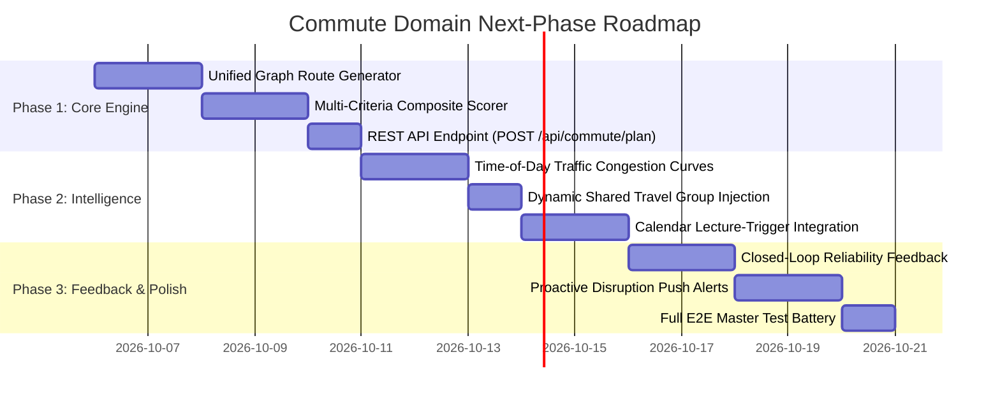

# Smart Commute Companion — Backend Architecture Verification & Roadmap

> **Document Version**: 1.0.0  
> **Date**: 2026-10-05  
> **Author**: Skan (Backend Lead)  
> **Status**: Verified & Active Architectural Roadmap  
> **Scope**: Final Architecture Verification of Day 14 Reset & Implementation Roadmap for Subsequent Commute Phases (P9)

---

## 1. Executive Summary & Verification of the Day 14 Reset

Day 14 accomplished a comprehensive architectural reset for the **Smart Student Commute Companion (P9)** backend. Rather than continuing with fragmented or speculative modules, the backend has been reorganized around the confirmed Problem Statement requirements:
- Multimodal transit routing tailored for Mumbai students (Western Railway, Metro Line 1, BEST buses, shared autos, and walking).
- Strict 4-tier data provenance (`VERIFIED`, `USER_REPORTED`, `ESTIMATED`, `SYNTHETIC`).
- Absolute privacy guarantees: coarse area-level landmarks only, zero storage of exact home addresses, flat numbers, or continuous GPS tracking history.
- Modular 9-stage recommendation pipeline with clean dependency injection, zero circular dependencies, and decoupled persistence.

### Verification of the Flow Foundation

The backend now contains a coherent, verified architectural foundation covering the full lifecycle:

```text
Student Profile & Preferences (StudentProfile, StudentSchedule, SavedRoute)
      ↓
Privacy-Safe Commute Request (CommutePlanInputDTO, CommuteArea)
      ↓
Transport Data (TransportService, TransportStop, TransportSchedule, TransportRepository)
      ↓
Disruption Data (CommuteDisruption, DisruptionRepository, DisruptionImpactService)
      ↓
Recommendation Pipeline (CommuteRecommendationPipeline)
      ↓
Future Route Engine (CandidateRouteService & Graph Routing Interface)
      ↓
Future Personalization (CommutePersonalizationService & Preference Weight Profiles)
      ↓
Future Explanation (CommuteExplanationService — Deterministic & Grounded)
      ↓
Alerts & Timed Reminders (NotificationService, ReminderScheduler, Socket.IO)
      ↓
Feedback & Reliability Loop (Feedback, FeedbackRepository, feedbackService)
      ↓
Shared Travel Coordination (RideGroup, RideGroupMember, Shared Travel APIs)
```

---

## 2. Architectural Audit Checklist & Findings

| Audit Check | Status | Verification Detail |
|---|---|---|
| **Duplicate domain models** | **Clean** | All commute contracts are consolidated in `backend/models/CommuteContracts.js`, `CommuteArea.js`, `CommutePlanInputDTO.js`, `TransportService.js`, `TransportStop.js`, `TransportSchedule.js`, and `CommuteDisruption.js`. Legacy models (`LiveReport`, `RideGroup`, `Feedback`) remain intact and are bridged via clean domain adapters (`CommuteDisruption.fromLiveReport`). |
| **Duplicated services** | **Clean** | Pipeline stages are partitioned into discrete, single-responsibility services (`commuteContextService`, `disruptionImpactService`, `candidateRouteService`, `constraintFilterService`, `routeScoringService`, `commutePersonalizationService`, `commuteExplanationService`). No duplicate logic across services. |
| **Inconsistent naming** | **Clean** | Enums strictly follow UPPER_SNAKE_CASE (`TRANSPORT_MODES`, `PROVENANCE_TIERS`, `DISRUPTION_SEVERITIES`, `LEG_TYPES`, `RECOMMENDATION_STATUS`). Value objects and DTOs use standardized camelCase (`startingArea`, `collegeDestination`, `totalDurationMinutes`, `totalFareRupees`, `walkingToleranceMinutes`). |
| **Inconsistent validation** | **Clean** | Location inputs are validated through `commuteAreaSchema` and `checkAreaGranularity()` across all endpoints. Strict 24-hour time format (`HH:MM`) is enforced via `strict24hTimeRegex`. Budget (>= 0) and walking tolerance (5 to 60 mins) bounds are uniform. |
| **Circular dependencies** | **Clean** | Dependency graph is strictly acyclic and unilateral: Domain Models → Repositories & Utilities → Stage Services → Pipeline Orchestrator. No service imports the top-level pipeline orchestrator. |
| **Unnecessary abstractions** | **Clean** | Avoided heavy GIS layers (no PostGIS, GeoServer, or TileServer GL). Zero bloated factory patterns; services use direct class instances with constructor dependency injection. |
| **Privacy violations** | **Clean** | `FORBIDDEN_PRIVACY_FIELDS` immediately rejects requests containing `lat`, `lon`, `gps`, `tracking`, `homeAddress`, `streetAddress`, `deviceId`, or `imei`. Regex filters reject granular apartment/flat/building/society strings. `sanitizeForLog()` strips all potential PII before logging. |
| **Database relationships** | **Clean** | Migration `011_commute_transport_and_disruptions.js` enforces foreign keys between `transport_services`, `transport_stops`, and `transport_schedules`. Covered indexes exist for corridor queries, service sequences, and active disruptions. |
| **Provenance handling** | **Clean** | All 4 tiers (`VERIFIED`, `USER_REPORTED`, `ESTIMATED`, `SYNTHETIC`) are strictly modeled with `sourceTier`, `provider`, and `confidence`. Validated by `provenanceSchema`. |
| **API/domain conventions** | **Clean** | Adheres to standardized responses (`success: true`, `timestamp`, pagination envelopes, operational error handling via `AppError`). |
| **Obvious N+1 risks** | **Clean** | `TransportRepository` and `DisruptionRepository` utilize joined and indexed batch queries for service stops, timetables, and active disruptions. |
| **Unnecessary dependencies**| **Clean** | Zero new external dependencies installed. Solution runs entirely on core Node.js, Express, SQLite, and Zod. |

---

## 3. Implementation Status Across the 16 Commute Capabilities

Below is the verified implementation status for each required commute capability as of Day 14:

```text
Status Legend:
[●] IMPLEMENTED           — Complete domain models, schemas, services, and tests in place.
[◐] PARTIALLY IMPLEMENTED — Architectural foundation and interfaces established; algorithm/integration pending.
[○] NOT IMPLEMENTED       — Planned for subsequent implementation phases.
```

### 1. Commute Preferences — [●] IMPLEMENTED
* **Status**: Complete domain and persistence models established.
* **What is Implemented**:
  * `StudentProfile` persistence (`preferred_modes`, `max_walking_minutes`, `max_budget`).
  * `StudentSchedule` persistence managing day-of-week commute schedules and target arrival times.
  * `CommuteConstraint` domain entity with methods: `allowsMode(mode)`, `isWithinBudget(fare)`, `isWithinWalkingLimit(minutes)`.
  * `CommutePlanInputDTO` enforcing strict preference boundaries and privacy rejection.
* **Remaining Work**: Dynamic preference learning based on student feedback history.

### 2. Route Generation — [◐] PARTIALLY IMPLEMENTED
* **Status**: Clean provider boundary and multimodal candidate synthesis implemented.
* **What is Implemented**:
  * `CandidateRouteService` interface defining candidate generation contract (`generateCandidates`).
  * Pluggable generator support (`customGenerator`) for controlled testing.
  * Multimodal candidate synthesis connecting corridor transit lines with access/egress walking legs and auto shuttles.
* **Remaining Work**: Full unified multimodal graph search algorithm combining multi-line transfers (Western Railway + Metro Line 1 + BEST bus) in a single pass.

### 3. Candidate Route Data — [●] IMPLEMENTED
* **Status**: Complete relational persistence, domain models, and static Mumbai seed data in place.
* **What is Implemented**:
  * Relational tables: `transport_services`, `transport_stops`, `transport_schedules`.
  * Domain entities: `CommuteRoute`, `RouteLeg`, `TravelEstimate`, `TransportService`, `TransportStop`, `TransportSchedule`.
  * Seed data for Western Railway, Metro Line 1, BEST bus routes, and auto-rickshaw feeder shuttles.
* **Remaining Work**: Expand static dataset to include Central Railway, Harbour Line, and Metro Line 2A/7 corridors.

### 4. Timetable Integration — [◐] PARTIALLY IMPLEMENTED
* **Status**: Relational timetable storage and schedule query service implemented.
* **What is Implemented**:
  * `transport_schedules` table with indexed `scheduled_departure` and `scheduled_arrival` (HH:MM).
  * Operating day bitmasks and arrays.
  * `TransportRepository.findSchedules()` and `TransportDataService.getUpcomingDepartures()`.
* **Remaining Work**: Live GTFS-RT feed ingestion adapter for dynamic headway adjustments when real-time feeds are available.

### 5. Disruption Impact Analysis — [◐] PARTIALLY IMPLEMENTED
* **Status**: Disruption entity, persistence, corridor impact matching, and penalty calculations implemented.
* **What is Implemented**:
  * `commute_disruptions` table and `CommuteDisruption` domain model with active status filtering.
  * `DisruptionImpactService` calculating base delay minutes scaled by severity and confidence tier.
  * Route-level disruption penalty calculation (`calculateRouteDisruptionPenalty` 0–100).
  * Bidirectional bridging from crowdsourced `live_commute_reports` (`CommuteDisruption.fromLiveReport`).
* **Remaining Work**: Geometric bounding-box spatial intersection for polygon-level disruption zones (e.g. flooded road sectors).

### 6. Traffic & Weather Context — [◐] PARTIALLY IMPLEMENTED
* **Status**: Weather API integration and weather penalty calculations implemented.
* **What is Implemented**:
  * Open-Meteo weather integration (`weatherService.js`).
  * Rain penalty calculation in `DisruptionImpactService` based on rain probability and walking exposure.
  * Weather context propagation through `CommuteContextService` and `CommuteRecommendation`.
* **Remaining Work**: Time-of-day peak congestion curves for Mumbai road corridors (SV Road, Linking Road, Western Express Highway).

### 7. Route Scoring — [◐] PARTIALLY IMPLEMENTED
* **Status**: Multi-criteria scoring foundation and preference weight profiles implemented.
* **What is Implemented**:
  * `RouteScoringService` computing sub-scores (time, cost, walking, reliability) and penalty deductions.
  * Preference weight matrices (`balanced`, `fastest`, `cheapest`, `rain-safe`).
  * Invariant comparator for deterministic route ranking.
* **Remaining Work**: Final multi-criteria scoring algorithm fine-tuning and dynamic weight adaptation from feedback.

### 8. Personalization — [◐] PARTIALLY IMPLEMENTED
* **Status**: Profile-informed context collection and preference ranking implemented.
* **What is Implemented**:
  * `CommuteContextService` loading student profile preferences and saved route shortcuts.
  * `CommutePersonalizationService` ranking routes by preference-weighted composite score.
  * Deterministic tie-breaking comparator.
* **Remaining Work**: Automatic urgency multipliers derived from calendar events (e.g., final exam day increases reliability weight).

### 9. AI & Rule-Based Explanations — [◐] PARTIALLY IMPLEMENTED
* **Status**: Grounded deterministic rule-based explanation engine implemented.
* **What is Implemented**:
  * `CommuteExplanationService` generating transparent, zero-hallucination explanations.
  * Primary rationale, trade-offs against alternative options, and active disruption/weather advisories.
  * `aiGenerated: false`, `aiProvider: 'Deterministic Rule Engine'`.
* **Remaining Work**: Optional Gemini conversational synthesis layer as a non-blocking enhancement when API key is provided.

### 10. Alternative Recommendations — [●] IMPLEMENTED
* **Status**: Diverse alternative curation fully implemented and tested.
* **What is Implemented**:
  * `CommutePersonalizationService._selectDiverseAlternatives()` automatically curating up to 3 distinct alternatives (fastest, cheapest, rain-safe/low-walking).
  * Validated against `commuteRecommendationSchema.alternatives`.

### 11. Departure-Time Recommendations — [●] IMPLEMENTED
* **Status**: Departure window calculations fully implemented and tested.
* **What is Implemented**:
  * `DepartureWindow` contract and schema.
  * `CommutePersonalizationService.calculateDepartureWindow()` calculating:
    * `optimalDepartureTime`: arrival - duration - safety buffer.
    * `latestSafeDepartureTime`: arrival - duration.
    * `recommendedWindowStart` & `recommendedWindowEnd`.
    * Provenance tagging (`SYNTHETIC`).

### 12. Alerts — [◐] PARTIALLY IMPLEMENTED
* **Status**: In-app notifications and real-time Socket.IO broadcasting implemented.
* **What is Implemented**:
  * `NotificationService` and `ReminderScheduler` for in-app alert delivery.
  * Socket.IO real-time event broadcasting on live disruption reports.
  * Disruption warning formatting inside recommendation explanations.
* **Remaining Work**: Proactive corridor push alerts triggering background notifications when disruptions occur on a student's scheduled commute route.

### 13. Shared Travel — [◐] PARTIALLY IMPLEMENTED
* **Status**: RideGroup persistence, membership, and landmark meeting points implemented.
* **What is Implemented**:
  * `RideGroup` and `RideGroupMember` domain models, repositories, and controllers (`/api/ride-groups`).
  * Privacy-safe landmark meeting points (stations, college gates; zero home pickups).
  * `SHARED_AUTO` mode support and `allowSharedRides` constraint validation.
* **Remaining Work**: Directly surfacing matching open ride groups within `CommuteRecommendation` candidate routes.

### 14. Recommendation Feedback — [◐] PARTIALLY IMPLEMENTED
* **Status**: Feedback persistence, sentiment scoring, and API implemented.
* **What is Implemented**:
  * `Feedback` domain model and `FeedbackRepository`.
  * `POST /api/feedback` endpoint with sentiment and useful tags.
  * `commuteFeedbackInputSchema` validation.
* **Remaining Work**: Closed-loop reliability calibration adjusting transport service reliability ratings based on historical student punctuality reports.

### 15. Integration with Calendar/Academic Context — [◐] PARTIALLY IMPLEMENTED
* **Status**: Academic domain models and schedule query services implemented.
* **What is Implemented**:
  * `CalendarEvent`, `Assignment`, `Goal` domain models and repositories.
  * `CalendarRangeService` and `WorkloadAnalysisService`.
  * Student schedule day-of-week lookup.
* **Remaining Work**: Automated commute trigger deriving `desiredArrivalTime` from the start time of the student's first lecture of the day.

### 16. End-to-End Testing — [◐] PARTIALLY IMPLEMENTED
* **Status**: Multi-tier verification test batteries implemented.
* **What is Implemented**:
  * `verify:commute-contracts`: 14/14 tests passing.
  * `verify:privacy-input`: 14/14 tests passing.
  * `verify:transport-data`: 9/9 tests passing.
  * `verify:commute-pipeline`: 10/10 tests passing.
  * `test:student`: 13/13 integration tests passing.
* **Remaining Work**: Full end-to-end HTTP integration test suite exercising `POST /api/commute/plan` through the complete 9-stage pipeline with live database seeding.

---

## 4. Phase-by-Phase Commute Development Roadmap



### Phase 1: Core Recommendation Engine & API Exposure
1. **Unified Multimodal Graph Route Generator**:
   - Enhance `CandidateRouteService` to compute multi-line transit combinations (Western Railway + Metro Line 1 + BEST bus) with OSRM pedestrian transfer segments in a single pass.
2. **Final Route Scoring Algorithm**:
   - Implement the complete deterministic scoring engine in `RouteScoringService`, dynamically weighting duration, fare, walking exertion, reliability, and real-time penalties.
3. **REST API Endpoint (`POST /api/commute/plan`)**:
   - Wire `CommuteRecommendationPipeline` to an Express route and controller guarded by `commutePlanRequestSchema`, returning standardized JSON envelopes with 4-tier provenance.

### Phase 2: Contextual Intelligence & Coordination
1. **Time-of-Day Traffic Congestion Curves**:
   - Apply deterministic peak/off-peak congestion multipliers for Mumbai road corridors (08:00–10:30 and 17:00–19:30).
2. **Shared Travel Matching in Route Outputs**:
   - Inspect active `RideGroup` instances and attach open group options directly to candidate routes that use `SHARED_AUTO`.
3. **Calendar Lecture-Trigger Integration**:
   - Automatically determine target arrival and departure times based on the student's scheduled calendar lectures.

### Phase 3: Feedback Loop, Proactive Alerts & Master E2E Suite
1. **Closed-Loop Reliability Feedback**:
   - Update `TransportRepository` line reliability ratings based on student post-commute feedback reports.
2. **Proactive Corridor Push Alerts**:
   - Trigger in-app notifications when a severe disruption occurs along a student's scheduled commute route.
3. **Master End-to-End Integration Suite**:
   - Build `scripts/test_commute_e2e.js` validating the full journey from schedule trigger to route recommendation, feedback submission, and reliability recalibration.

---

## 5. Architectural Sign-Off

The Day 14 architectural reset is verified and complete. The backend possesses a clean, decoupled, privacy-safe, and test-backed foundation ready for the Phase 1 route-scoring and recommendation engine implementation.
